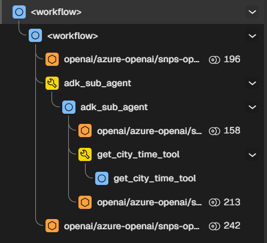
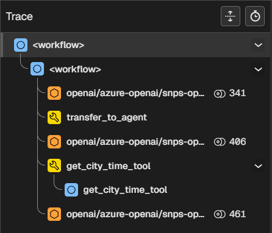

# Multi-Agent NAT (NVIDIA Agent Toolkit) Project

This project demonstrates different architectural approaches for implementing multi-agent systems using NAT (NVIDIA Agent Toolkit) with Google ADK (Agent Development Kit).

Ideally, NAT should let wrapped agents call other wrapped agents while retaining their native capabilities. Key capabilities include:
- Agent types: `LlmAgent` (reasoning via LLM), `SequentialAgent`, `ParallelAgent`, `LoopAgent` (deterministic workflow orchestrators), and custom agents (by extending `BaseAgent`).
- Hierarchical composition: Parent agents list child agents via `sub_agents` to form trees; ADK enforces a single-parent rule and provides navigation helpers.

Agentic transfer passes control and context between agents. ADK supports:
- **Execution control:** An LLM issues a `transfer_to_agent` function call, setting `EventActions.transfer_to_agent` to the target agent name; the framework routes execution accordingly.
- **InvocationContext:** The target agent receives the same invocation context, including shared session state and events, per-agent `agent_states` for checkpoint/resume, a branch path (e.g., `parent.child`) for history isolation, and services such as artifact, memory, and credential handling plus `invocation_id` and `user_content`.
- **Agent state:** For resumable sessions, `agent_states` lets the target agent continue from where it left off; the framework inspects the last event to decide which sub-agent to resume.
- **Conversation history:** Events move with the transfer. In a `ParallelAgent`, each child gets a distinct branch to isolate history.
- **Transfer targets and instructions:** `TransferToAgentTool` injects system instructions listing available agents (sub-agents, parent, and peers) with enum constraints to reduce hallucinations.

NAT should be able to allow all these transfers while being minimally invasive.

## Architectural Approaches

### Approach 1: Agent-as-a-Tool (`nat_adk_individual_wrap/`)

Each agent is individually wrapped as a separate NAT function and managed independently. Sub-agents are treated as tools that can be called by other agents.



### Approach 2: Wrap LLM calls and Tool calls (`nat_adk_single_wrap/`)

The entire multi-agent system is wrapped as a single NAT function with internal agent composition. LLM calls and tool calls are wrapped together within a unified system.



### Approach 3: Native Agent Support in NAT
NAT natively supports agents and their interactions without needing to wrap them as tools. This will require adding an `agent` component to NAT and framework-specific implementation for each agent type.


## Usage

### Approach 1 (Individual Wrap)
```bash
nat run --config_file src/nat_adk_individual_wrap/configs/config.yml --input "What is the time in New York?"
```

### Approach 2 (Single Wrap)
```bash
nat run --config_file src/nat_adk_single_wrap/configs/config.yml --input "What is the time in New York?"
```

### Approach 3 (Native Agent Support)
Find the sample config file in the src/3_native_agent_component/configs/ directory.
